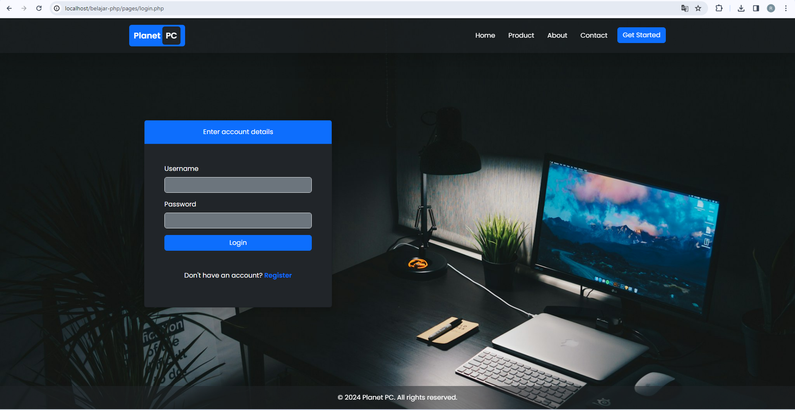
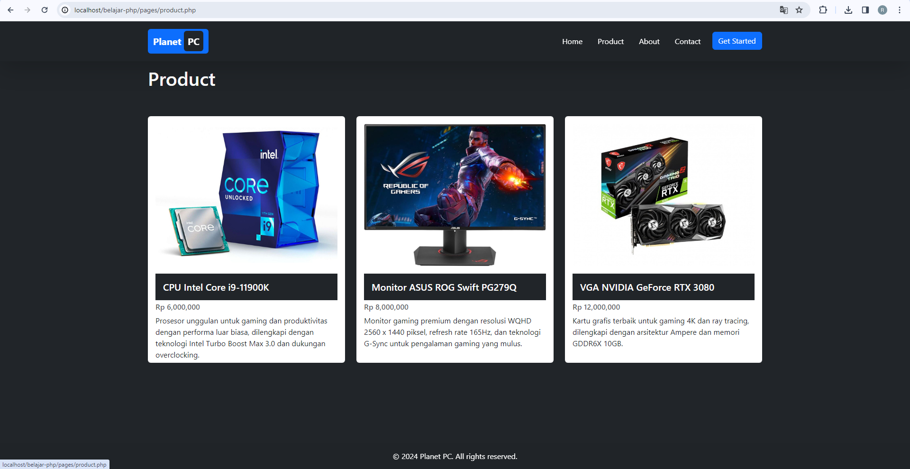

# Tugas PHP Dasar 1 - Aplikasi Manajemen Produk

Ini adalah aplikasi sederhana untuk manajemen produk yang dibuat menggunakan PHP, HTML, CSS, dan JavaScript. Aplikasi ini memenuhi persyaratan tugas PHP Dasar 1 yang diberikan.

## Fitur Aplikasi

1. **Halaman Login:**

   - Pengguna dapat memasukkan nama pengguna dan kata sandi untuk masuk ke aplikasi.
   - Validasi sederhana dilakukan pada formulir login.

2. **Halaman Listing Produk:**
   - Menampilkan daftar produk dari variabel PHP.
   - Setiap produk ditampilkan dengan informasi seperti nama produk, harga, dan deskripsi.

## Struktur Direktori

- `css/`: Direktori untuk file-file CSS.
- `js/`: Direktori untuk file-file JavaScript.
- `index.php`: Halaman utama aplikasi.
- `pages/login.php`: Halaman login.
- `pages/produk.php`: Halaman listing produk.
- `README.md`: Dokumentasi aplikasi (file ini).

## Cara Menjalankan Aplikasi

1. Pastikan Anda memiliki server web lokal yang mendukung PHP, seperti XAMPP atau WAMP.
2. Salin semua file ke dalam direktori root server web Anda.
3. Buka browser dan akses aplikasi melalui URL yang sesuai, misalnya `http://localhost/belajar-php`.

## Tampilan Aplikasi

Berikut adalah screenshot tampilan aplikasi:

**Halaman Login:**

**Halaman Listing Produk:**

## Catatan Tambahan

- Aplikasi ini adalah versi sederhana dan hanya digunakan untuk tujuan pembelajaran.
- Untuk pengembangan lebih lanjut, Anda dapat menambahkan fitur otentikasi pengguna yang lebih kuat, validasi input yang lebih mendalam, dan fungsi CRUD untuk manajemen produk.

Terima kasih telah menggunakan aplikasi ini! Jika Anda memiliki pertanyaan atau saran, jangan ragu untuk menghubungi saya.
